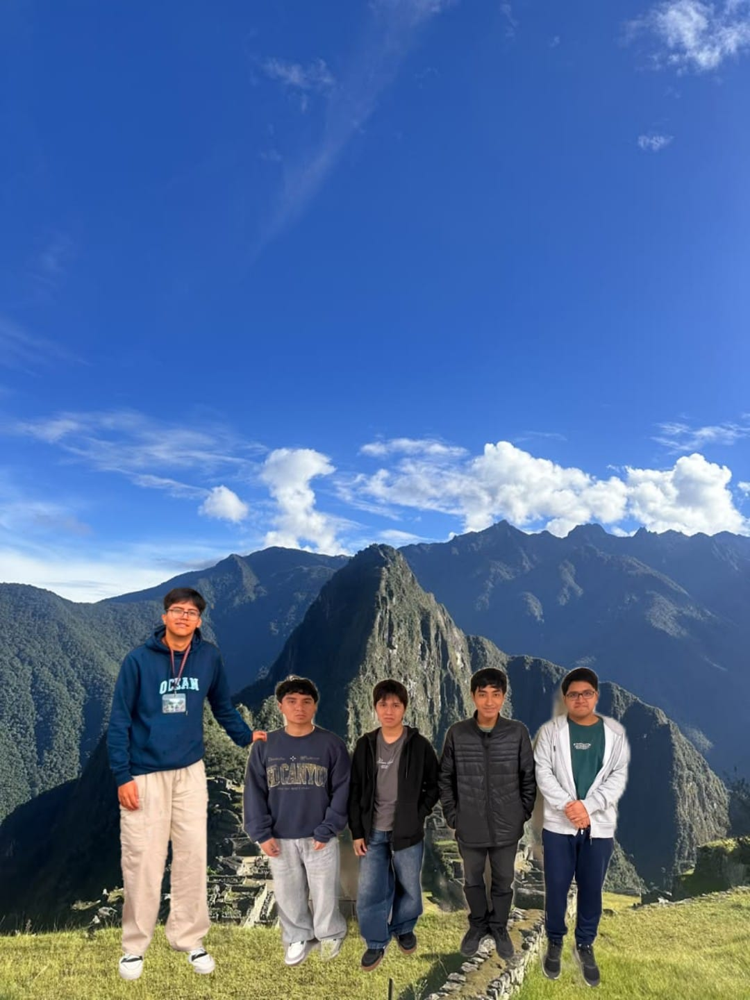

# PDBI_G2
Somos alumnos del 6to ciclo del curso de Proyectos de Biodiseño, nos dedicamos a investigar y diseñar dispositivos biomédicos, empleando herramientas de ingeniería biomédica para dar solución a problemáticas de salud en el Perú.
## Objetivo:
Diseñar y desarrollar un dispositivo biomédico que contribuya a mejorar la calidad de la atención médica en el país, a través del uso de tecnologías innovadoras y accesibles.
## Integrantes:
| Nombres | Rol | Correo |
| :--- | :---: | ---: |
| Jared Matias Neciosup Villarreal | Líder de Modelado y Diseño Mecánico | jared.neciosup@upch.pe |
| Ricardo Percy Torres Castañeda | Líder de Gestión de Proyecto | ricardo.torres@upch.pe  |
| Gustavo Alonso Vásquez Cruz | Líder de Electrónica y PCB |  gustavo.vasquez@upch.pe |
| Jostin Rajhúl Murga Quispe | Líder de Software | jostin.murga@upch.pe |
| Jairo Gonzalo Cochachin Falero | Líder de Investigación Clínica | jairo.cochachin@upch.pe |  

